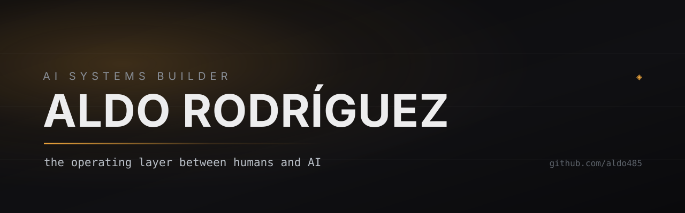

  

## I build the operating layer between humans and AI.

My background is in customer-facing sales and operations: understanding business needs, communicating value, resolving complex problems, and making processes work for the people using them. I bring that perspective to AI-agent orchestration and workflow architecture — connecting tools, preserving context, and verifying outcomes.

### 🧭 What I focus on

- **AI-agent orchestration and MCP/connectors.** Workflows with clear responsibilities, shared context, and structured handoffs across tools.
- **Operational problem solving.** Translate ambiguous customer and business needs into practical workflows, requirements, and success criteria.
- **Human-in-the-loop systems.** Explicit approval boundaries, accountable ownership, and recovery when a workflow breaks.
- **Verification and read-back.** Check the resulting state in the source system; distinguish a reported success from an observed outcome.

### 🏗️ Selected work

| Project | Focus | Where |
|---|---|---|
| **Job-Hunt Automation** | AI-assisted exploration of job-search workflows, recovery, and verification | *private, in progress* |
| **Knowledge Base** | Organizing context and reusable guidance for agent workflows | *private* |
| **America133** | Automation-studio landing-page project built with Lovable | [repo](https://github.com/aldo485/america-landing-architect) |

### ⚙️ How I work

1. **Start with the customer problem** — define the need and what a useful outcome looks like.
2. **Read broadly, write narrowly** — inspect current evidence and make deliberate changes.
3. **Verify independently** — read back results before calling work complete.
4. **Collaborate with technical teams** — communicate requirements, constraints, and findings clearly.

### 🧰 Tools and approach

AI-agent tools · MCP/connectors · Git/GitHub · Linear · knowledge and workflow systems

I use AI-assisted prototyping to explore implementations and troubleshoot workflows. My contribution centers on orchestration, workflow design, and verification; I collaborate with engineers on code and deployment decisions.

---

  <a href="https://linkedin.com/in/aldo-rodriguez-940a3b122">LinkedIn</a> ·
  <a href="https://github.com/aldo485">github.com/aldo485</a>

